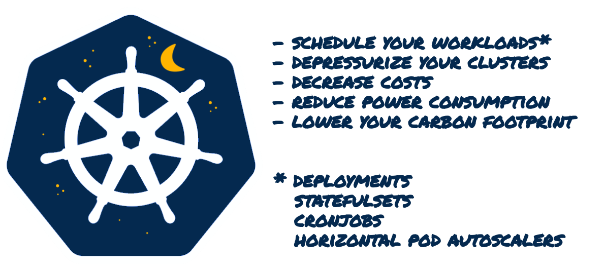
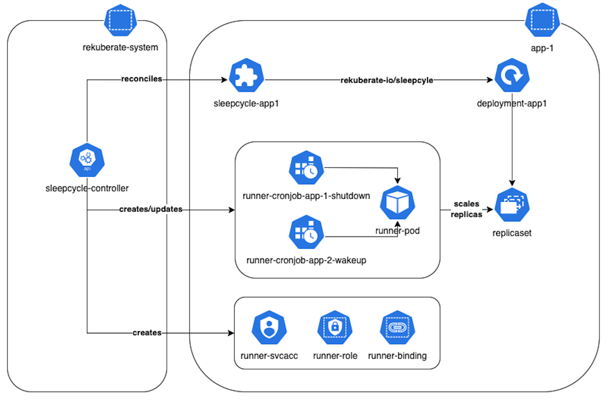

Define sleep & wake up cycles for your Kubernetes resources. Automatically schedule to shutdown **Deployments**, **CronJobs**, 
**StatefulSets** and **HorizontalPodAutoscalers** that occupy resources in your cluster and wake them up **only** when you need them; 
in that way you can: 

- _schedule_ resource-hungry workloads (migrations, synchronizations, replications) in hours that do not impact your daily business
- _depressurize_ your cluster
- _decrease_ your costs
- _reduce_ your power consumption
- _lower_ you carbon footprint

> [!NOTE]
> You can read more in medium article [rekuberate-io/sleepcycles: an automated way to reclaim your unused Kubernetes resources](https://medium.com/@akyriako/rekuberate-io-sleepcycles-an-automated-way-to-reclaim-your-unused-kubernetes-resources-852e8db313ec).

## Getting Started
You’ll need a Kubernetes cluster to run against. You can use [KIND](https://sigs.k8s.io/kind) or [K3D](https://k3d.io) to get a local cluster for testing, 
or run against a remote cluster. 

> [!CAUTION]
> Earliest compatible Kubernetes version is **1.25** 

### Samples

Under `config/samples` you will find a set manifests that you can use to test this sleepcycles on your cluster:

#### SleepCycles

* _core_v1alpha1_sleepcycle_app_x.yaml_, manifests to deploy 2 `SleepCycle` resources in namespaces `app-1` and `app-2`

```yaml
apiVersion: core.rekuberate.io/v1alpha1
kind: SleepCycle
metadata:
  name: sleepcycle-app-1
  namespace: app-1
spec:
  shutdown: "1/2 * * * *"
  shutdownTimeZone: "Europe/Athens"
  wakeup: "*/2 * * * *"
  wakeupTimeZone: "Europe/Dublin"
  enabled: true
```

Every `SleepCycle` has the following **mandatory** properties:

- `shutdown`: cron expression for your shutdown schedule
- `enabled`: whether this sleepcycle policy is enabled

and the following **non-mandatory** properties:

- `shutdownTimeZone`: the timezone for your shutdown schedule, defaults to `UTC`
- `wakeup`: cron expression for your wake-up schedule
- `wakeupTimeZone`: the timezone for your wake-up schedule, defaults to `UTC`
- `successfulJobsHistoryLimit`: how many _completed_ CronJob Runner Pods to retain for debugging reasons, defaults to `1`
- `failedJobsHistoryLimit`: how many _failed_ CronJob Runner Pods to retain for debugging reasons, defaults to `1`
- `runnerImage`: the image to use when spawn CronJob Runner pods, defaults to `akyriako78/rekuberate-io-sleepcycles-runners`

#### Demo workloads

* _whoami-app-1_x-deployment.yaml_, manifests to deploy 2 `Deployment` that provisions _traefik/whoami_ in namespace `app-1` 
* _whoami-app-2_x-deployment.yaml_, manifests to deploy a `Deployment`that provisions _traefik/whoami_ in namespace `app-2`

`SleepCycle` is a namespace-scoped custom resource; the controller will monitor all the resources in that namespace that
are marked with a `Label` that has as key `rekuberate.io/sleepcycle:` and as value the `name` of the manifest you created:

```yaml
apiVersion: apps/v1
kind: Deployment
metadata:
  name: app-2
  namespace: app-2
  labels:
    app: app-2
    rekuberate.io/sleepcycle: sleepcycle-app-2
spec:
  replicas: 9
  selector:
    matchLabels:
      app: app-2
  template:
    metadata:
      name: app-2
      labels:
        app: app-2
    spec:
      containers:
        - name: app-2
          image: traefik/whoami
          imagePullPolicy: IfNotPresent
```

> [!IMPORTANT]
> Any workload in namespace `kube-system` marked with `rekuberate.io/sleepcycle` will be ignored by the controller **by design**.

## How it works



## Deploy

### From sources

1. Build and push your image to the location specified by `IMG` in `Makefile`:

```shell
# Image URL to use all building/pushing image targets
IMG_TAG ?= $(shell git rev-parse --short HEAD)
IMG_NAME ?= rekuberate-io-sleepcycles
DOCKER_HUB_NAME ?= $(shell docker info | sed '/Username:/!d;s/.* //')
IMG ?= $(DOCKER_HUB_NAME)/$(IMG_NAME):$(IMG_TAG)
RUNNERS_IMG_NAME ?= rekuberate-io-sleepcycles-runners
KO_DOCKER_REPO ?= $(DOCKER_HUB_NAME)/$(RUNNERS_IMG_NAME)
```

```sh
make docker-build docker-push
```

2. Deploy the controller to the cluster using the image defined in `IMG`:

```sh
make deploy
```

and then deploy the samples:

```sh
kubectl create namespace app-1
kubectl create namespace app-2
kubectl apply -f config/samples
```

#### Uninstall

```sh
make undeploy
```

### Using Helm

You can alternatively, it is **highly recommended**, deploy the controller to the cluster using a **Helm chart**:

```sh
helm install rekuberate-io-sleepcycles config/helm/ -n <namespace> --create-namespace
```

and then deploy the samples:

```sh
kubectl create namespace app-1
kubectl create namespace app-2
kubectl apply -f config/samples
```
#### Uninstall

```shell
helm uninstall rekuberate-io-sleepcycles -n <namespace>
```

## Develop

This project aims to follow the Kubernetes [Operator pattern](https://kubernetes.io/docs/concepts/extend-kubernetes/operator/). It uses [Controllers](https://kubernetes.io/docs/concepts/architecture/controller/)
which provides a reconcile function responsible for synchronizing resources until the desired state is reached on the cluster.

### Controller

#### Modifying the API definitions
If you are editing the API definitions, generate the manifests such as CRs or CRDs using:

```sh
make generate
make manifests
```

then install the CRDs in the cluster with:

```sh
make install
```

> [!TIP]
> You can debug the controller in the IDE of your choice by hooking to the `main.go` **or** you can start
> the controller _without_ debugging with:

```sh
make run
```

> [!TIP]
> Run `make --help` for more information on all potential `make` targets 
> More information can be found via the [Kubebuilder Documentation](https://book.kubebuilder.io/introduction.html)

#### Build

You always need to build a new docker container and push it to your repository:

```sh
make docker-build docker-push
```

> [!IMPORTANT]
> In this case you will need to adjust your Helm chart values to use your repository and container image.

### Runner

#### Build

```sh
make docker-build docker-push
```

> [!IMPORTANT]
> In this case you will need to adjust the `runnerImage` of your `SleepCycle` manifest to use your own Runner image.

### Uninstall CRDs
To delete the CRDs from the cluster:

```sh
make uninstall
```
